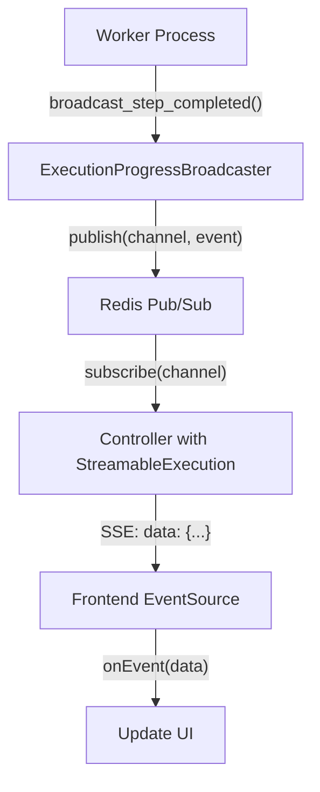

# Real-Time Event Streaming Architecture

**Tags**: [architecture, design]  
**Applies To**: Any system requiring real-time updates (Ruby/Rails + Redis + JavaScript as reference)  
**Date**: 2026-01-05

## Overview

Real-time event streaming enables clients to receive immediate updates about long-running server-side processes. This architecture uses Redis pub/sub for event distribution and Server-Sent Events (SSE) for pushing updates to clients.

**When to use this pattern:**
- Long-running background jobs need to report progress
- Multiple clients need updates about the same process
- Real-time status updates improve user experience
- One-way server-to-client communication is sufficient (no client acknowledgment needed)

## Streaming Architecture Pattern

```
Event Publishing Pattern
├── Background Worker/Process
│   ├── Performs long-running work
│   ├── Uses: Broadcaster service
│   └── Publishes: Lifecycle events (started, progress, completed, failed)
│
├── Broadcaster Service (centralized)
│   ├── Defines: Event types as constants
│   ├── Validates: Event types before publishing
│   ├── Publishes to: Message broker (Redis pub/sub, Kafka, RabbitMQ)
│   └── Channel naming: Hierarchical pattern (scope:purpose:identifier)
│
└── Message Broker
    ├── Channel per execution/session
    ├── Payload: {id, event_type, timestamp, data}
    └── Multiple subscribers can listen

Event Subscription Pattern  
├── Controller/API Endpoint
│   ├── Includes: SSE/streaming capability
│   ├── Subscribes to: Broker channel
│   ├── Streams to: Client via SSE
│   └── Auto-closes: On terminal events
│
├── SSE Setup
│   ├── Headers: Content-Type: text/event-stream, no-cache
│   ├── Format: "event: {type}\ndata: {json}\n\n"
│   ├── Terminal detection: completed|failed|cancelled
│   └── Cleanup: Close stream on terminal or disconnect
│
└── Error Handling
    ├── Client disconnect: Graceful cleanup
    ├── Broker errors: Log and close stream
    └── Timeout: Optional for long-running processes

Frontend Consumption Pattern
├── EventSource API
│   ├── Create: new EventSource(streamUrl)
│   ├── Listen: addEventListener(eventType, handler)
│   ├── Cleanup: close() on unmount
│   └── Reconnect: Automatic (built-in)
│
├── Utility Wrapper
│   ├── Abstracts: EventSource complexity
│   ├── Provides: Callbacks (onEvent, onComplete, onError)
│   ├── Handles: Terminal event detection
│   └── Returns: Cleanup function
│
└── State Integration
    ├── Subscribe on mount
    ├── Update state on events
    ├── Cleanup on unmount
    └── Store reference for manual close
```

---

## Rules

### [ARCH][!PUBLISHER-BROADCASTER-PATTERN]

**Rule**: Create a single broadcaster service that publishes events to Redis channels, not individual publishing logic scattered across workers.

**Bad Example:**

```ruby
# ❌ Each worker has its own Redis publishing logic
class SisyphusWorker
  def perform(execution_id)
    redis = Redis.new(url: ENV['REDIS_URL'])
    redis.publish("sisyphus:#{execution_id}", {event: "started"}.to_json)
    
    # ... work
    
    redis.publish("sisyphus:#{execution_id}", {event: "step_complete"}.to_json)
  end
end

class DaedalusWorker
  def perform(execution_id)
    redis = Redis.new(url: ENV['REDIS_URL'])
    redis.publish("daedalus:#{execution_id}", {event: "started"}.to_json)
    
    # ... different event format, different channel pattern
  end
end

# Result: Inconsistent event formats, channel naming, no type safety
```

**Good Example:**

```ruby
# ✅ Single broadcaster with consistent interface
class ExecutionProgressBroadcaster
  EVENT_TYPES = [
    "started",
    "step_started",
    "step_completed",
    "step_failed",
    "milestone_started",
    "milestone_completed",
    "completed",
    "failed",
    "cancelled",
    "checkpoint_created",
    "file_changed"
  ].freeze

  def initialize(redis: Redis.new(url: ENV['REDIS_URL']))
    @redis = redis
  end

  def broadcast_started(execution_id:, plan_path:, project_path:)
    validate_execution_id!(execution_id)
    
    broadcast_event(
      execution_id: execution_id,
      event_type: "started",
      data: {
        plan_path: plan_path,
        project_path: project_path,
        started_at: Time.now.utc.iso8601
      }
    )
  end

  def broadcast_step_completed(execution_id:, step_number:, files_changed: [], progress_percentage: nil)
    validate_execution_id!(execution_id)
    
    broadcast_event(
      execution_id: execution_id,
      event_type: "step_completed",
      data: {
        step_number: step_number,
        files_changed: files_changed,
        progress_percentage: progress_percentage,
        timestamp: Time.now.utc.iso8601
      }
    )
  end

  private

  def broadcast_event(execution_id:, event_type:, data:)
    raise ArgumentError, "Invalid event_type: #{event_type}" unless EVENT_TYPES.include?(event_type)
    
    channel = channel_name(execution_id)
    payload = {
      execution_id: execution_id,
      event_type: event_type,
      timestamp: Time.now.utc.iso8601,
      data: data
    }.to_json
    
    @redis.publish(channel, payload)
  end

  def channel_name(execution_id)
    "worker:progress:#{execution_id}"
  end

  def validate_execution_id!(execution_id)
    raise TypeError unless execution_id.is_a?(String)
  end
end

# All workers use the same broadcaster
class SisyphusWorker
  def perform(execution_id)
    @broadcaster = ExecutionProgressBroadcaster.new
    
    @broadcaster.broadcast_started(
      execution_id: execution_id,
      plan_path: @plan_path,
      project_path: @project_path
    )
    
    # ... work
    
    @broadcaster.broadcast_step_completed(
      execution_id: execution_id,
      step_number: 1,
      files_changed: ["app/models/user.rb"],
      progress_percentage: 25.0
    )
  end
end
```

**Why**: Centralized broadcasting ensures consistent event formats, validates event types, and makes changing the implementation (e.g., switching from Redis to Kafka) trivial.

---

### [ARCH][!SSE-CONTROLLER-CONCERN]

**Rule**: Extract SSE streaming logic into a reusable controller concern, not duplicated across controller actions.

**Bad Example:**

```ruby
# ❌ Duplicated SSE logic in every controller
class SisyphusController < ApplicationController
  include ActionController::Live

  def stream_progress
    response.headers['Content-Type'] = 'text/event-stream'
    response.headers['Cache-Control'] = 'no-cache'
    response.headers['X-Accel-Buffering'] = 'no'
    
    execution_id = params["execution_id"]
    redis = Redis.new(url: ENV['REDIS_URL'])
    
    redis.subscribe("sisyphus:#{execution_id}") do |on|
      on.message do |channel, message|
        sse.write({data: message}, event: 'progress')
        sse.close if JSON.parse(message)['event_type'] == 'completed'
      end
    end
  rescue IOError
    # Client disconnected
  ensure
    sse.close
  end
end

class DaedalusController < ApplicationController
  include ActionController::Live

  def stream_progress
    # ... exact same SSE setup copied
    # ... exact same Redis subscription copied
    # ... exact same error handling copied
  end
end
```

**Good Example:**

```ruby
# ✅ Reusable concern for SSE streaming
module StreamableExecution
  extend ActiveSupport::Concern

  included do
    include ActionController::Live
  end

  def stream_execution_progress(execution_id)
    setup_sse_headers
    
    redis = Redis.new(url: ENV['REDIS_URL'])
    
    redis.subscribe(channel_name(execution_id)) do |on|
      on.subscribe do |channel, subscriptions|
        stream_event('connected', {execution_id: execution_id})
      end

      on.message do |channel, message|
        data = JSON.parse(message, symbolize_names: true)
        stream_event('progress', data)
        
        # Auto-close on terminal events
        if terminal_event?(data[:event_type])
          break
        end
      end
    end
  rescue IOError, ActionController::Live::ClientDisconnected => e
    Rails.logger.info("Client disconnected from stream: #{e.message}")
  rescue => e
    Rails.logger.error("Stream error: #{e.message}")
    stream_event('error', {message: e.message})
  ensure
    close_stream
  end

  private

  def setup_sse_headers
    response.headers['Content-Type'] = 'text/event-stream'
    response.headers['Cache-Control'] = 'no-cache'
    response.headers['X-Accel-Buffering'] = 'no'
    response.headers['Connection'] = 'keep-alive'
  end

  def stream_event(event_type, data)
    response.stream.write("event: #{event_type}\n")
    response.stream.write("data: #{data.to_json}\n\n")
  end

  def close_stream
    response.stream.close rescue nil
  end

  def channel_name(execution_id)
    "worker:progress:#{execution_id}"
  end

  def terminal_event?(event_type)
    ['completed', 'failed', 'cancelled'].include?(event_type)
  end
end

# Controllers just include the concern
class SisyphusController < ApplicationController
  include StreamableExecution

  def stream_progress
    stream_execution_progress(params["execution_id"])
  end
end

class DaedalusController < ApplicationController
  include StreamableExecution

  def stream_progress
    stream_execution_progress(params["execution_id"])
  end
end
```

**Why**: Concerns eliminate duplication, centralize error handling, and make SSE logic testable in isolation.

---

### [ARCH][!CHANNEL-NAMING-CONVENTION]

**Rule**: Use consistent, hierarchical channel naming conventions for Redis pub/sub.

**Bad Example:**

```ruby
# ❌ Inconsistent channel naming
redis.publish("sisyphus_#{execution_id}", message)          # Snake case
redis.publish("daedalus-execution-#{execution_id}", message) # Kebab case
redis.publish("worker/#{worker_type}/#{execution_id}", message) # Slashes
redis.publish("progress:#{execution_id}", message)          # Missing context
```

**Good Example:**

```ruby
# ✅ Consistent hierarchical naming
module ChannelNames
  # Pattern: scope:purpose:identifier
  def self.worker_progress(execution_id)
    "worker:progress:#{execution_id}"
  end

  def self.worker_logs(execution_id)
    "worker:logs:#{execution_id}"
  end

  def self.agent_thoughts(session_id)
    "agent:thoughts:#{session_id}"
  end

  def self.system_health
    "system:health"
  end
end

# Usage
redis.publish(ChannelNames.worker_progress(execution_id), message)
redis.subscribe(ChannelNames.worker_progress(execution_id)) { |msg| ... }
```

**Why**: Consistent naming makes channels predictable, enables pattern-based subscriptions, and improves debugging.

---

### [ARCH][!TERMINAL-EVENT-DETECTION]

**Rule**: Automatically close SSE streams when terminal events are detected (completed, failed, cancelled).

**Bad Example:**

```ruby
# ❌ Client must detect completion and close
redis.subscribe(channel) do |on|
  on.message do |channel, message|
    stream_event('progress', JSON.parse(message))
    # Never closes - wastes resources
  end
end
```

**Good Example:**

```ruby
# ✅ Server detects terminal events and closes
TERMINAL_EVENTS = ['completed', 'failed', 'cancelled'].freeze

redis.subscribe(channel) do |on|
  on.message do |channel, message|
    data = JSON.parse(message, symbolize_names: true)
    stream_event('progress', data)
    
    if TERMINAL_EVENTS.include?(data[:event_type])
      Rails.logger.info("Terminal event #{data[:event_type]}, closing stream")
      break  # Exit subscription loop
    end
  end
end
```

**Why**: Automatic cleanup prevents resource leaks and makes client implementation simpler.

---

### [ARCH][!FRONTEND-EVENTSOURCE-UTILITY]

**Rule**: Create reusable frontend utilities for EventSource subscriptions with consistent error handling.

**Bad Example:**

```javascript
// ❌ EventSource logic duplicated everywhere
function subscribeToSisyphus(executionId) {
  const es = new EventSource(`/api/sisyphus/stream/${executionId}`);
  
  es.addEventListener('progress', (e) => {
    const data = JSON.parse(e.data);
    console.log('Progress:', data);
  });
  
  es.onerror = (e) => {
    console.error('Error:', e);
    es.close();
  };
}

function subscribeToDaedalus(sessionId) {
  const es = new EventSource(`/api/daedalus/stream/${sessionId}`);
  
  es.addEventListener('progress', (e) => {
    // ... same logic copied
  });
  
  es.onerror = (e) => {
    // ... same error handling copied
  };
}
```

**Good Example:**

```javascript
// ✅ Reusable utility for any worker stream
export function subscribeToWorkerProgress({
  streamUrl,
  onEvent,
  onError,
  onComplete,
  onConnected
}) {
  const eventSource = new EventSource(streamUrl);

  eventSource.addEventListener('connected', (e) => {
    const data = JSON.parse(e.data);
    console.log('Stream connected:', data);
    onConnected?.(data);
  });

  eventSource.addEventListener('progress', (e) => {
    const data = JSON.parse(e.data);
    
    // Terminal events
    if (['completed', 'failed', 'cancelled'].includes(data.event_type)) {
      onComplete?.(data);
      eventSource.close();
      return;
    }
    
    // Progress events
    onEvent(data);
  });

  eventSource.addEventListener('error', (e) => {
    const data = e.data ? JSON.parse(e.data) : {message: 'Unknown error'};
    console.error('Stream error:', data);
    onError?.(data);
    eventSource.close();
  });

  eventSource.onerror = () => {
    console.error('EventSource connection error');
    onError?.({message: 'Connection failed'});
    eventSource.close();
  };

  return eventSource;
}

// Usage for any worker type
const eventSource = subscribeToWorkerProgress({
  streamUrl: `/api/sisyphus/executions/${executionId}/stream`,
  onEvent: (data) => {
    updateUI(data);
  },
  onComplete: (data) => {
    showCompleted(data);
  },
  onError: (error) => {
    showError(error);
  }
});

// Later, cleanup
eventSource.close();
```

**Why**: Reusable utilities eliminate duplication, provide consistent error handling, and make testing easier.

---

## Patterns

### Pattern: Complete Streaming Architecture



**Backend: Worker Integration**

```ruby
class SisyphusWorker
  def perform(plan_path, project_path, execution_id)
    @broadcaster = ExecutionProgressBroadcaster.new
    
    # 1. Notify start
    @broadcaster.broadcast_started(
      execution_id: execution_id,
      plan_path: plan_path,
      project_path: project_path
    )
    
    begin
      # 2. Execute work with progress updates
      plan.milestones.each_with_index do |milestone, idx|
        @broadcaster.broadcast_milestone_started(
          execution_id: execution_id,
          milestone_number: idx + 1,
          milestone_title: milestone.title
        )
        
        execute_milestone(milestone)
        
        @broadcaster.broadcast_milestone_completed(
          execution_id: execution_id,
          milestone_number: idx + 1,
          checkpoint_id: create_checkpoint
        )
      end
      
      # 3. Notify completion
      @broadcaster.broadcast_completed(
        execution_id: execution_id,
        total_files_changed: @total_files_changed,
        total_steps: @total_steps
      )
    rescue => error
      # 4. Notify failure
      @broadcaster.broadcast_failed(
        execution_id: execution_id,
        error_message: error.message,
        failed_at: Time.now.utc.iso8601
      )
      raise
    end
  end
end
```

**Backend: Controller**

```ruby
class Api::Sisyphus::ExecutionsController < ApplicationController
  include StreamableExecution

  # GET /api/sisyphus/executions/:execution_id/stream
  def stream
    execution_id = params["execution_id"]
    
    # Verify execution exists and user has access
    execution = Execution.find_by!(external_id: execution_id)
    authorize! :read, execution
    
    stream_execution_progress(execution_id)
  end
end
```

**Frontend: Subscription**

```javascript
import { subscribeToWorkerProgress } from './utils/workerProgressStream';

// Subscribe to progress
const eventSource = subscribeToWorkerProgress({
  streamUrl: `/api/sisyphus/executions/${executionId}/stream`,
  
  onConnected: (data) => {
    console.log('Connected to stream:', data.execution_id);
  },
  
  onEvent: (event) => {
    console.log('Progress event:', event.event_type, event.data);
    
    switch(event.event_type) {
      case 'step_started':
        updateStepStatus(event.data.step_number, 'running');
        break;
      
      case 'step_completed':
        updateStepStatus(event.data.step_number, 'complete');
        updateProgress(event.data.progress_percentage);
        break;
      
      case 'file_changed':
        addChangedFile(event.data.file_path);
        break;
      
      case 'checkpoint_created':
        addCheckpoint(event.data.checkpoint_id);
        break;
    }
  },
  
  onComplete: (data) => {
    console.log('Execution complete:', data);
    showSuccessMessage(`Completed: ${data.data.total_steps} steps`);
  },
  
  onError: (error) => {
    console.error('Stream error:', error);
    showErrorMessage(error.message);
  }
});

// Cleanup when component unmounts
onCleanup(() => {
  eventSource.close();
});
```

---

### Pattern: Zustand Store Integration

```javascript
// Store integration for automatic state updates
import { create } from 'zustand';
import { subscribeToWorkerProgress } from './utils/workerProgressStream';

const useExecutionStore = create((set) => ({
  currentExecution: null,
  progress: 0,
  completedSteps: [],
  changedFiles: [],
  
  startExecution: (executionId) => {
    const eventSource = subscribeToWorkerProgress({
      streamUrl: `/api/sisyphus/executions/${executionId}/stream`,
      
      onEvent: (event) => {
        set((state) => {
          switch(event.event_type) {
            case 'started':
              return {
                currentExecution: event.data,
                progress: 0,
                completedSteps: [],
                changedFiles: []
              };
            
            case 'step_completed':
              return {
                progress: event.data.progress_percentage,
                completedSteps: [...state.completedSteps, event.data.step_number],
                changedFiles: [...state.changedFiles, ...event.data.files_changed]
              };
            
            default:
              return state;
          }
        });
      },
      
      onComplete: (data) => {
        set({ currentExecution: null, progress: 100 });
      },
      
      onError: (error) => {
        set({ currentExecution: null, error: error.message });
      }
    });
    
    set({ eventSource });
  },
  
  stopExecution: () => {
    set((state) => {
      state.eventSource?.close();
      return { eventSource: null, currentExecution: null };
    });
  }
}));

// Usage in components
function ExecutionMonitor({ executionId }) {
  const { progress, completedSteps, startExecution, stopExecution } = useExecutionStore();
  
  useEffect(() => {
    startExecution(executionId);
    return () => stopExecution();
  }, [executionId]);
  
  return (
    <div>
      <ProgressBar value={progress} />
      <StepList steps={completedSteps} />
    </div>
  );
}
```

---

## Real-World Examples

### Example 1: Multi-Worker Type Support

```ruby
# Single broadcaster supports all worker types
class ExecutionProgressBroadcaster
  # Works for Sisyphus, Daedalus, ProjectPlanner, etc.
  def broadcast_started(execution_id:, **data)
    broadcast_event(
      execution_id: execution_id,
      event_type: "started",
      data: data.merge(started_at: Time.now.utc.iso8601)
    )
  end
end

# Each worker uses the same broadcaster
class SisyphusWorker
  def perform(execution_id)
    broadcaster = ExecutionProgressBroadcaster.new
    broadcaster.broadcast_started(
      execution_id: execution_id,
      worker_type: "sisyphus",
      plan_path: @plan_path
    )
  end
end

class DaedalusWorker
  def perform(execution_id)
    broadcaster = ExecutionProgressBroadcaster.new
    broadcaster.broadcast_started(
      execution_id: execution_id,
      worker_type: "daedalus",
      session_id: @session_id
    )
  end
end

# Controllers include the same concern
class Api::Sisyphus::ExecutionsController < ApplicationController
  include StreamableExecution
  
  def stream
    stream_execution_progress(params["execution_id"])
  end
end

class Api::Daedalus::SessionsController < ApplicationController
  include StreamableExecution
  
  def stream
    stream_execution_progress(params["session_id"])
  end
end
```

### Example 2: Adding New Event Types

```ruby
# Step 1: Add event type to broadcaster
class ExecutionProgressBroadcaster
  EVENT_TYPES = [
    "started",
    "step_started",
    "step_completed",
    # ... existing events
    "tool_executed",  # NEW
  ].freeze

  def broadcast_tool_executed(execution_id:, tool_name:, result:, duration_ms:)
    broadcast_event(
      execution_id: execution_id,
      event_type: "tool_executed",
      data: {
        tool_name: tool_name,
        result: result,
        duration_ms: duration_ms,
        timestamp: Time.now.utc.iso8601
      }
    )
  end
end

# Step 2: Workers call new broadcast method
class SisyphusWorker
  def execute_tool(tool, params)
    start_time = Time.now
    
    result = tool.execute(params)
    
    duration_ms = ((Time.now - start_time) * 1000).round
    
    @broadcaster.broadcast_tool_executed(
      execution_id: @execution_id,
      tool_name: tool.class.name,
      result: result,
      duration_ms: duration_ms
    )
    
    result
  end
end

# Step 3: Frontend handles new event
subscribeToWorkerProgress({
  streamUrl: `/api/sisyphus/executions/${executionId}/stream`,
  
  onEvent: (event) => {
    switch(event.event_type) {
      case 'tool_executed':
        console.log(`Tool ${event.data.tool_name} took ${event.data.duration_ms}ms`);
        logToolExecution(event.data);
        break;
      
      // ... other events
    }
  }
});
```

---

## Checklist

When implementing streaming architecture:

- [ ] Single broadcaster service handles all event publishing
- [ ] Event types are defined and validated
- [ ] Channel naming follows consistent convention (scope:purpose:id)
- [ ] SSE logic extracted into reusable controller concern
- [ ] Terminal events automatically close streams
- [ ] Frontend utility provides consistent EventSource interface
- [ ] Error handling covers client disconnection gracefully
- [ ] Connected event sent on successful subscription
- [ ] Event payloads include timestamp and execution_id
- [ ] Redis connection pooling configured for production
- [ ] Streams auto-close to prevent resource leaks
- [ ] Documentation covers adding new event types
- [ ] Security: validate user has access to stream

---

## Performance & Security Considerations

**Performance:**
- Redis pub/sub handles thousands of concurrent subscribers efficiently
- SSE maintains single HTTP connection (more efficient than polling)
- Keep event payloads small (< 1KB recommended)
- Always close EventSource when component unmounts
- Frontend handles automatic reconnection on network issues

**Security:**
- Authenticate users before allowing stream subscription
- Validate execution_id ownership before streaming
- Consider rate limiting on SSE endpoints
- Validate execution_id format to prevent injection attacks

**Monitoring:**
- Track active SSE connections
- Monitor Redis pub/sub subscriber counts
- Alert on excessive channel creation
- Log stream errors for debugging

---

## Summary

**Key Principles:**

1. **Single broadcaster** publishes all events
2. **Consistent channels** use hierarchical naming
3. **Reusable concern** handles SSE streaming
4. **Terminal events** auto-close streams
5. **Frontend utility** provides consistent interface

**Benefits:**

- Centralized event publishing
- Consistent event formats across workers
- Automatic cleanup of streams
- Easy to add new event types
- Client implementation is trivial
- Scales to thousands of subscribers

**When to Use:**

- Long-running background jobs
- Real-time progress updates needed
- Multiple clients monitoring same process
- One-way server-to-client sufficient (no acknowledgments needed)

