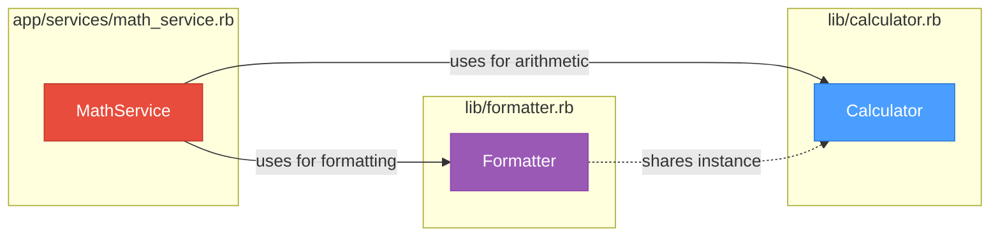

# app/services/math_service.rb

## Summary

MathService is a high-level application service that provides business-oriented mathematical operations with formatted output. It acts as a facade combining Calculator for computations and Formatter for display formatting. The service handles common business scenarios like totals calculation, statistics, discounts, value comparisons, and compound interest. Implements dependency injection and shares the Calculator instance between itself and Formatter.

## Source

- [View Code](../../../app/services/math_service.rb)

## External References



**Dependency Analysis:**
- **Inbound:** Application entry point (used by controllers, other services)
- **Outbound:** 
  - `Calculator` (direct dependency for arithmetic)
  - `Formatter` (direct dependency for formatting)
  - Shares `Calculator` instance with `Formatter`

## Method Architecture

```mermaid
flowchart TD
    subgraph MathService
        init["initialize(calculator:, formatter:)"]
        calculate_total["calculate_total(items)"]
        calculate_statistics["calculate_statistics(numbers)"]
        apply_discount["apply_discount(original_price, discount_percent)"]
        compare_values["compare_values(before, after)"]
        compound_interest["compound_interest(principal, rate, years, compounds_per_year:)"]
        empty_statistics["empty_statistics (private)"]
    end
    
    subgraph Calculator["Calculator"]
        calc_multiply["multiply"]
        calc_average["average"]
        calc_percentage["percentage"]
        calc_subtract["subtract"]
        calc_divide["divide"]
    end
    
    subgraph Formatter["Formatter"]
        fmt_currency["currency"]
        fmt_percent["percent"]
        fmt_pct_change["percentage_change"]
    end
    
    init -->|"creates instances"| Calculator
    init -->|"creates with shared calc"| Formatter
    
    calculate_total -->|"calls"| calc_multiply
    calculate_total -->|"calls"| fmt_currency
    
    calculate_statistics -->|"calls"| calc_average
    calculate_statistics -->|"calls"| fmt_currency
    calculate_statistics -.->|"when empty"| empty_statistics
    
    apply_discount -->|"calls"| calc_percentage
    apply_discount -->|"calls"| calc_subtract
    apply_discount -->|"calls"| fmt_currency
    apply_discount -->|"calls"| fmt_percent
    
    compare_values -->|"calls"| calc_subtract
    compare_values -->|"calls"| fmt_currency
    compare_values -->|"calls"| fmt_pct_change
    
    compound_interest -->|"calls"| calc_divide
    compound_interest -->|"calls"| calc_multiply
    compound_interest -->|"calls"| calc_subtract
    compound_interest -->|"calls"| fmt_currency
    compound_interest -->|"calls"| fmt_percent
    
    style init fill:#6c757d,stroke:#545b62,color:#fff
    style calculate_total fill:#28a745,stroke:#1e7e34,color:#fff
    style calculate_statistics fill:#28a745,stroke:#1e7e34,color:#fff
    style apply_discount fill:#28a745,stroke:#1e7e34,color:#fff
    style compare_values fill:#28a745,stroke:#1e7e34,color:#fff
    style compound_interest fill:#17a2b8,stroke:#117a8b,color:#fff
    style empty_statistics fill:#6c757d,stroke:#545b62,color:#fff
```



## Attributes

### calculator (read-only)

Returns the Calculator instance used for arithmetic operations.

**Type:** `Calculator`

### formatter (read-only)

Returns the Formatter instance used for output formatting.

**Type:** `Formatter`

## Methods

### initialize(calculator: nil, formatter: nil)

Constructor with dependency injection. Creates Calculator if not provided, then creates Formatter sharing the same Calculator instance.

| Parameter | Type | Default | Description |
|-----------|------|---------|-------------|
| `calculator` | Calculator | nil | Calculator instance |
| `formatter` | Formatter | nil | Formatter instance |

**Instance Sharing Pattern:**
```ruby
@calculator = calculator || Calculator.new
@formatter = formatter || Formatter.new(calculator: @calculator)
```

---

### calculate_total(items)

Calculates the total cost from a list of items with quantities and prices.

| Parameter | Type | Description |
|-----------|------|-------------|
| `items` | Array<Hash> | Array of `{ quantity:, price: }` hashes |

**Returns:** `Hash` with keys:
- `raw` - Numeric total
- `formatted` - Currency-formatted string

**Uses:**
- `calculator.multiply` for line item calculations
- `formatter.currency` for formatting

---

### calculate_statistics(numbers)

Calculates descriptive statistics for a numeric dataset.

| Parameter | Type | Description |
|-----------|------|-------------|
| `numbers` | Array<Numeric> | Dataset to analyze |

**Returns:** `Hash` with keys:
- `count` - Number of elements
- `min` - Minimum value
- `max` - Maximum value
- `sum` - Total sum
- `average` - Arithmetic mean
- `formatted_average` - Currency-formatted average

**Returns:** `empty_statistics` hash if array is empty

**Uses:**
- `calculator.average` for mean calculation
- `formatter.currency` for formatting

---

### apply_discount(original_price, discount_percent)

Applies a discount and returns comprehensive pricing details.

| Parameter | Type | Description |
|-----------|------|-------------|
| `original_price` | Numeric | Original price |
| `discount_percent` | Numeric | Discount percentage (0-100) |

**Returns:** `Hash` with keys:
- `original` - Formatted original price
- `discount` - Formatted discount percentage
- `savings` - Formatted savings amount
- `final` - Formatted final price
- `raw_final` - Numeric final price

**Uses:**
- `calculator.percentage` for discount calculation
- `calculator.subtract` for final price
- `formatter.currency` and `formatter.percent` for formatting

---

### compare_values(before, after)

Compares two values showing the change metrics.

| Parameter | Type | Description |
|-----------|------|-------------|
| `before` | Numeric | Initial value |
| `after` | Numeric | Final value |

**Returns:** `Hash` with keys:
- `before` - Formatted before value
- `after` - Formatted after value
- `change` - Formatted percentage change
- `difference` - Formatted absolute difference

**Uses:**
- `calculator.subtract` for difference
- `formatter.currency` for value formatting
- `formatter.percentage_change` for change calculation

---

### compound_interest(principal, rate, years, compounds_per_year: 12)

Calculates compound interest using formula: A = P(1 + r/n)^(nt)

| Parameter | Type | Default | Description |
|-----------|------|---------|-------------|
| `principal` | Numeric | - | Initial investment |
| `rate` | Numeric | - | Annual rate as percentage |
| `years` | Integer | - | Time period in years |
| `compounds_per_year` | Integer | 12 | Compounding frequency |

**Returns:** `Hash` with keys:
- `principal` - Formatted principal
- `final_amount` - Formatted final amount
- `interest_earned` - Formatted interest
- `effective_rate` - Formatted effective rate
- `raw_final` - Numeric final amount

**Uses:**
- `calculator.divide`, `calculator.multiply`, `calculator.subtract`
- `formatter.currency`, `formatter.percent`

---

### empty_statistics (private)

Returns a default statistics hash for empty datasets.

**Returns:** `Hash` with zero/nil values and "N/A" for formatted_average

## Usage Examples

### Basic Total Calculation

```ruby
service = MathService.new
items = [
  { quantity: 2, price: 29.99 },
  { quantity: 1, price: 49.99 }
]
result = service.calculate_total(items)
# => { raw: 109.97, formatted: "$109.97" }
```

### Discount Application

```ruby
service = MathService.new
result = service.apply_discount(100.00, 20)
# => {
#   original: "$100.00",
#   discount: "20.0%",
#   savings: "$20.00",
#   final: "$80.00",
#   raw_final: 80.0
# }
```

### Statistics Calculation

```ruby
service = MathService.new
result = service.calculate_statistics([10, 20, 30, 40, 50])
# => {
#   count: 5,
#   min: 10,
#   max: 50,
#   sum: 150,
#   average: 30.0,
#   formatted_average: "$30.00"
# }
```

### Compound Interest

```ruby
service = MathService.new
result = service.compound_interest(10000, 5, 10)
# => {
#   principal: "$10000.00",
#   final_amount: "$16470.09",
#   interest_earned: "$6470.09",
#   effective_rate: "64.7%",
#   raw_final: 16470.09...
# }
```

## Design Notes

1. **Facade Pattern**: Simplifies complex operations by combining Calculator and Formatter
2. **Dependency Injection**: Allows testing with mocks and custom implementations
3. **Instance Sharing**: Formatter receives the same Calculator instance for consistency
4. **Dual Output**: Methods return both raw values and formatted strings for flexibility

