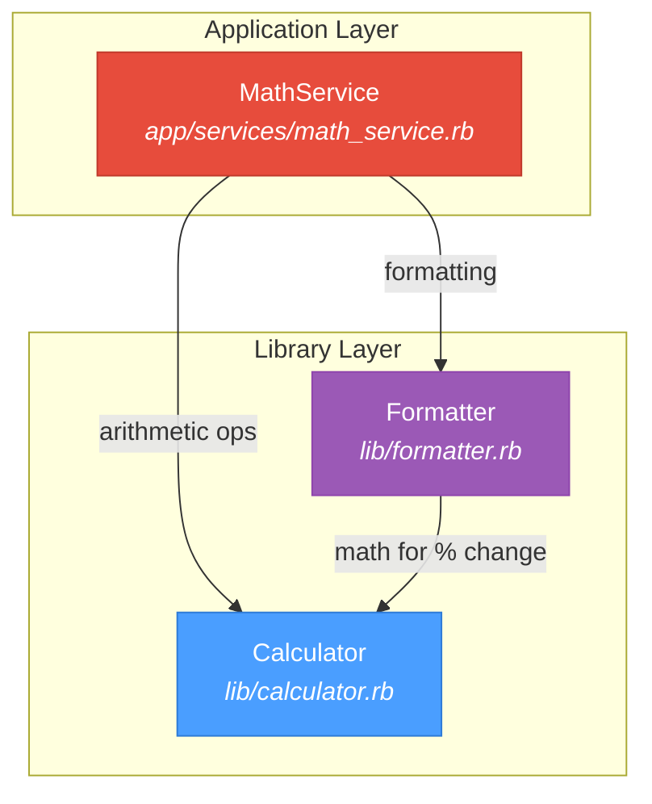

# Base References

## Directory Tree

```
example_codebase/
├── app/
│   └── services/
│       └── math_service.rb    # High-level math service combining Calculator + Formatter
├── lib/
│   ├── calculator.rb          # Core arithmetic operations (add, subtract, multiply, divide, percentage, average)
│   └── formatter.rb           # Number formatting (currency, percent, separators, ratio)
├── docs/
│   ├── base_references.md     # This file - directory tree and synthesis
│   ├── app/
│   │   └── services/
│   │       └── math_service.md  # MathService documentation
│   └── lib/
│       ├── calculator.md      # Calculator documentation
│       └── formatter.md       # Formatter documentation
├── Gemfile                    # Dependencies (pure Ruby, no external gems)
└── README.md                  # Project overview
```

## File Summary Table

| File | Type | Purpose | Dependencies |
|------|------|---------|--------------|
| `lib/calculator.rb` | Core Library | Basic arithmetic operations | None |
| `lib/formatter.rb` | Core Library | Number formatting utilities | Calculator |
| `app/services/math_service.rb` | Service | Business-level math operations | Calculator, Formatter |

## Dependency Graph



## Class Quick Reference

### Calculator

```
Calculator
├── DivisionByZeroError (exception)
├── add(a, b)
├── subtract(a, b)
├── multiply(a, b)
├── divide(a, b)
├── percentage(value, percentage)
└── average(numbers)
```

### Formatter

```
Formatter
├── attr: calculator
├── initialize(calculator:)
├── currency(value, currency:, decimals:)
├── percent(value, decimals:)
├── with_separators(value, separator:)
├── percentage_change(old_value, new_value)
└── ratio(numerator, denominator, simplify:)
```

### MathService

```
MathService
├── attr: calculator, formatter
├── initialize(calculator:, formatter:)
├── calculate_total(items)
├── calculate_statistics(numbers)
├── apply_discount(original_price, discount_percent)
├── compare_values(before, after)
├── compound_interest(principal, rate, years, compounds_per_year:)
└── empty_statistics (private)
```

---

# Synthesis Summary

## Research Questions Answered

### 1. How does the Calculator class work? What operations does it support?

Calculator is a stateless class providing six arithmetic operations:
- **Basic ops**: `add`, `subtract`, `multiply`, `divide`
- **Derived ops**: `percentage` (uses multiply), `average` (uses divide)

Error handling includes `DivisionByZeroError` for division by zero and `ArgumentError` for empty array averaging.

### 2. What is the relationship between Formatter and Calculator?

Formatter **depends on** Calculator via dependency injection:
- Constructor accepts optional `calculator:` parameter
- Creates new Calculator instance if none provided
- Uses Calculator's `subtract`, `divide`, `multiply` methods in `percentage_change` calculation
- Other formatting methods are pure string manipulation

### 3. How does MathService use both Calculator and Formatter?

MathService acts as a **facade** combining both dependencies:
- **Calculator**: Used for all arithmetic (totals, statistics, discounts, interest)
- **Formatter**: Used to format output values (currency, percentages)
- **Instance sharing**: MathService passes its Calculator instance to Formatter, ensuring consistent behavior

Flow pattern in most methods:
1. Calculate using Calculator methods
2. Format using Formatter methods  
3. Return hash with both raw and formatted values

### 4. What are the dependencies between these classes?

```
Dependency Direction (depends on →):

┌─────────────┐
│ MathService │
└─────┬───────┘
      │
      ├──────────────────┐
      │                  │
      ▼                  ▼
┌───────────┐     ┌───────────┐
│ Calculator│ ◄───│ Formatter │
└───────────┘     └───────────┘

MathService → Calculator (direct)
MathService → Formatter (direct)
Formatter → Calculator (for percentage_change)
Calculator → None (leaf dependency)
```

**Key insight**: Calculator is the only class with no dependencies, making it the foundation. Formatter adds display logic on top. MathService orchestrates both for business operations.

### 5. What design patterns are used in this codebase?

| Pattern | Implementation | Location |
|---------|----------------|----------|
| **Dependency Injection** | Constructor accepts dependencies; uses defaults if not provided | All three classes |
| **Facade Pattern** | MathService simplifies access to Calculator + Formatter | MathService |
| **Single Responsibility** | Each class has one clear purpose | All classes |
| **Composition over Inheritance** | Classes combine via composition, no inheritance hierarchy | MathService |
| **Null Object Pattern** | Empty statistics returned instead of nil/error | `empty_statistics` |
| **Instance Sharing** | Calculator instance shared between MathService and Formatter | Constructor |

## Architecture Overview

The codebase implements a **layered architecture**:

1. **Foundation Layer** (`lib/calculator.rb`)
   - Zero dependencies
   - Pure computation
   - Error handling at boundaries

2. **Presentation Layer** (`lib/formatter.rb`)
   - Depends on Foundation
   - String formatting
   - Display concerns

3. **Service Layer** (`app/services/math_service.rb`)
   - Depends on Foundation + Presentation
   - Business logic
   - Orchestration

This design enables:
- Easy testing via dependency injection
- Clear separation of concerns
- Flexible composition
- Consistent behavior through instance sharing

