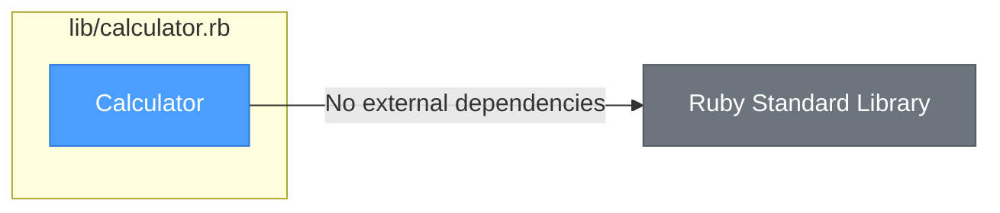
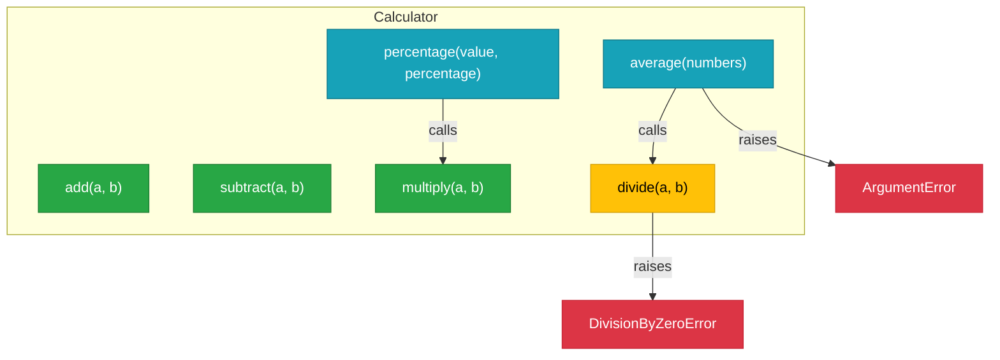

# lib/calculator.rb

## Summary

The Calculator class is the foundational math utility providing basic arithmetic operations. It serves as the core computation layer used by Formatter and MathService. The class implements six mathematical operations with proper error handling for edge cases like division by zero and empty arrays.

## Source

- [View Code](../../lib/calculator.rb)

## External References



**Dependency Analysis:**
- **Inbound:** Used by `Formatter` and `MathService`
- **Outbound:** None (pure Ruby, no external gems)

## Method Architecture



## Classes

### Calculator::DivisionByZeroError

Custom error class raised when attempting to divide by zero. Inherits from `StandardError`.

## Methods

### add(a, b)

Adds two numbers together.

| Parameter | Type | Description |
|-----------|------|-------------|
| `a` | Numeric | First number |
| `b` | Numeric | Second number |

**Returns:** `Numeric` - Sum of a and b

---

### subtract(a, b)

Subtracts b from a.

| Parameter | Type | Description |
|-----------|------|-------------|
| `a` | Numeric | Number to subtract from |
| `b` | Numeric | Number to subtract |

**Returns:** `Numeric` - Difference of a and b

---

### multiply(a, b)

Multiplies two numbers.

| Parameter | Type | Description |
|-----------|------|-------------|
| `a` | Numeric | First factor |
| `b` | Numeric | Second factor |

**Returns:** `Numeric` - Product of a and b

---

### divide(a, b)

Divides a by b with zero-division protection.

| Parameter | Type | Description |
|-----------|------|-------------|
| `a` | Numeric | Dividend |
| `b` | Numeric | Divisor |

**Returns:** `Float` - Quotient of a divided by b

**Raises:** `DivisionByZeroError` if b is zero

---

### percentage(value, percentage)

Calculates a percentage of a value. Internally calls `multiply` then divides by 100.

| Parameter | Type | Description |
|-----------|------|-------------|
| `value` | Numeric | The value to calculate percentage of |
| `percentage` | Numeric | The percentage to calculate |

**Returns:** `Float` - The percentage of the value

**Internal Calls:** `multiply(value, percentage)`

---

### average(numbers)

Calculates the arithmetic mean of an array of numbers. Uses `divide` internally for the calculation.

| Parameter | Type | Description |
|-----------|------|-------------|
| `numbers` | Array<Numeric> | Array of numbers to average |

**Returns:** `Float` - The arithmetic mean

**Raises:** `ArgumentError` if array is empty

**Internal Calls:** `divide(numbers.sum, numbers.size)`

## Usage Example

```ruby
calc = Calculator.new
calc.add(5, 3)          # => 8
calc.subtract(10, 4)    # => 6
calc.multiply(3, 7)     # => 21
calc.divide(15, 3)      # => 5.0
calc.percentage(200, 15) # => 30.0
calc.average([10, 20, 30]) # => 20.0
```

## Error Handling

```ruby
calc = Calculator.new
calc.divide(10, 0)    # raises Calculator::DivisionByZeroError
calc.average([])      # raises ArgumentError
```

