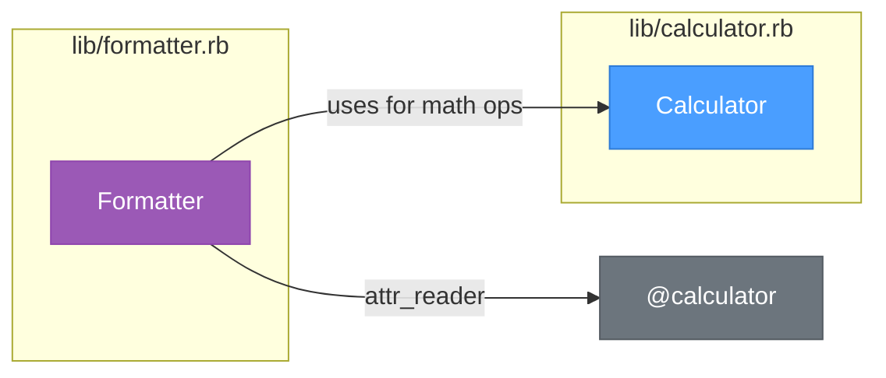
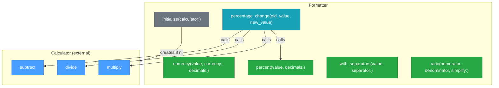

# lib/formatter.rb

## Summary

The Formatter class provides number formatting utilities for display purposes. It formats numbers as currency, percentages, ratios, and adds thousand separators. The class depends on Calculator for mathematical operations needed in complex formatting scenarios like percentage change calculations. Uses dependency injection to receive a Calculator instance.

## Source

- [View Code](../../lib/formatter.rb)

## External References



**Dependency Analysis:**
- **Inbound:** Used by `MathService`
- **Outbound:** `Calculator` (injected via constructor, used in `percentage_change`)

## Method Architecture



## Attributes

### calculator (read-only)

Returns the Calculator instance used for mathematical operations.

**Type:** `Calculator`

## Methods

### initialize(calculator: nil)

Constructor that accepts an optional Calculator instance. Creates a new Calculator if none provided.

| Parameter | Type | Default | Description |
|-----------|------|---------|-------------|
| `calculator` | Calculator | nil | Calculator instance for math operations |

---

### currency(value, currency: "$", decimals: 2)

Formats a number as currency with configurable symbol and decimal places.

| Parameter | Type | Default | Description |
|-----------|------|---------|-------------|
| `value` | Numeric | - | The value to format |
| `currency` | String | "$" | Currency symbol |
| `decimals` | Integer | 2 | Number of decimal places |

**Returns:** `String` - Formatted currency string (e.g., "$100.00")

---

### percent(value, decimals: 1)

Formats a number as a percentage string.

| Parameter | Type | Default | Description |
|-----------|------|---------|-------------|
| `value` | Numeric | - | The value (0-100 scale) |
| `decimals` | Integer | 1 | Number of decimal places |

**Returns:** `String` - Formatted percentage string (e.g., "25.5%")

---

### with_separators(value, separator: ",")

Formats a number with thousand separators for readability.

| Parameter | Type | Default | Description |
|-----------|------|---------|-------------|
| `value` | Numeric | - | The value to format |
| `separator` | String | "," | Thousand separator character |

**Returns:** `String` - Formatted number string (e.g., "1,234,567")

**Logic:**
- Handles both integers and floats
- For floats, preserves 2 decimal places

---

### percentage_change(old_value, new_value)

Calculates and formats the percentage change between two values. This is the most complex method, using Calculator for all arithmetic.

| Parameter | Type | Description |
|-----------|------|-------------|
| `old_value` | Numeric | The original value |
| `new_value` | Numeric | The new value |

**Returns:** `String` - Formatted percentage change with +/- prefix (e.g., "+25.0%", "-10.5%")

**Returns:** `"N/A"` if old_value is zero

**Internal Flow:**
1. `calculator.subtract(new_value, old_value)` → difference
2. `calculator.divide(difference, old_value)` → change ratio
3. `calculator.multiply(change, 100)` → percentage
4. `percent(change_percent)` → formatted string

---

### ratio(numerator, denominator, simplify: false)

Formats a ratio as "X:Y" notation with optional simplification using GCD.

| Parameter | Type | Default | Description |
|-----------|------|---------|-------------|
| `numerator` | Numeric | - | The numerator |
| `denominator` | Numeric | - | The denominator |
| `simplify` | Boolean | false | Whether to simplify using GCD |

**Returns:** `String` - Formatted ratio string (e.g., "3:4")

## Usage Example

```ruby
formatter = Formatter.new
formatter.currency(1234.56)              # => "$1234.56"
formatter.currency(99.9, currency: "€")  # => "€99.90"
formatter.percent(75.5)                  # => "75.5%"
formatter.with_separators(1234567)       # => "1,234,567"
formatter.percentage_change(100, 125)    # => "+25.0%"
formatter.percentage_change(100, 80)     # => "-20.0%"
formatter.ratio(6, 8, simplify: true)    # => "3:4"
```

## Dependency Injection Pattern

```ruby
# Using default Calculator
formatter = Formatter.new

# Injecting custom Calculator
custom_calc = Calculator.new
formatter = Formatter.new(calculator: custom_calc)

# Sharing Calculator instance (as MathService does)
calc = Calculator.new
formatter = Formatter.new(calculator: calc)
# Both formatter and external code use the same calc instance
```

